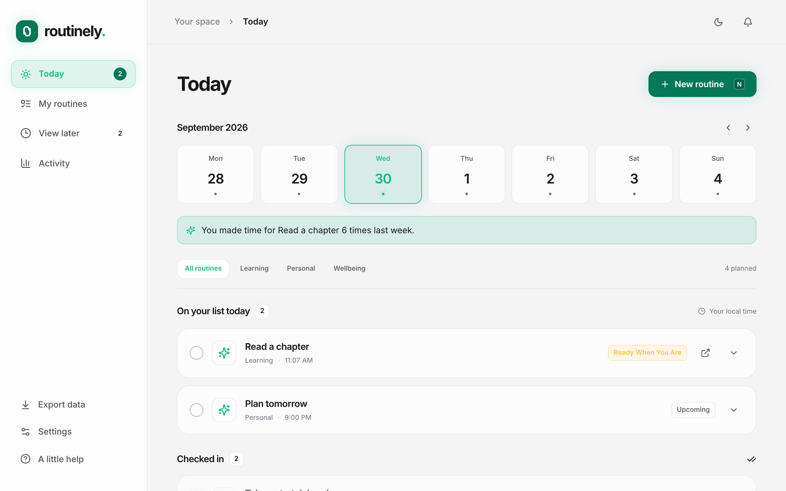
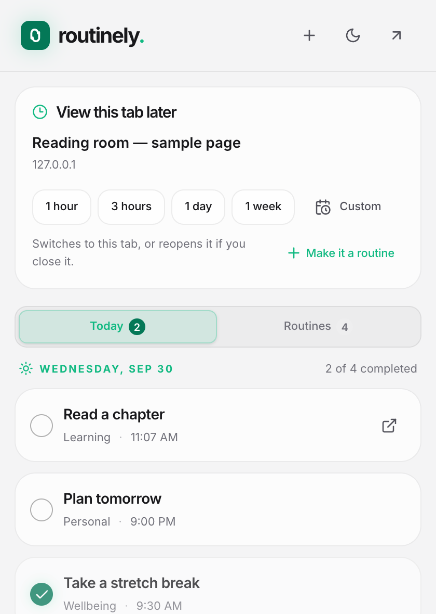
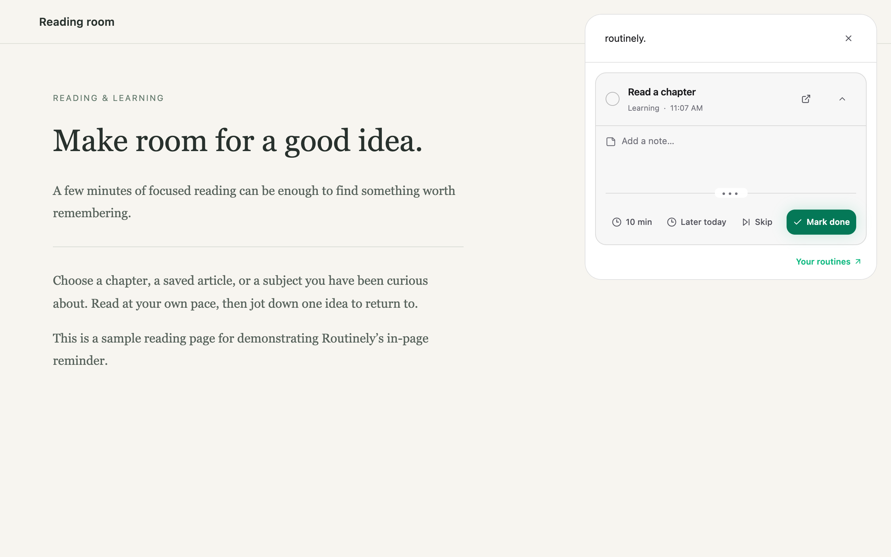

<p>
  
</p>

# Routinely

A quiet browser extension for the things you want to keep coming back to. Built with **WXT, React, TypeScript, Tailwind CSS, and shadcn-style Radix primitives**, managed with **pnpm**.

[Website](https://liuyang1520.github.io/routinely/) · [Privacy policy](https://liuyang1520.github.io/routinely/privacy.html)

## Screenshots

### Homepage



### Extension popover



### Floating reminder



These captures show the production extension with illustrative data. The logo is SVG, and screenshots are captured at 2× resolution. Regenerate them after `pnpm build` with `pnpm screenshots`; this uses a disposable Chromium profile.

## Start developing

Requires Node.js 22.12+ and pnpm 10.34.1 (the version is pinned in `package.json`).

```sh
pnpm install
pnpm dev
```

WXT opens a development browser with the extension installed. Click its toolbar icon, then **Open my routines** to open the full dashboard. To develop with Firefox, use `pnpm dev:firefox`.

All dependencies must be at least **seven days old**: `pnpm-workspace.yaml` sets `minimumReleaseAge: 10080`. The lockfile is included. Only esbuild's dependency build script is allowed.

## Load a production build

```sh
pnpm build
```

1. Open `chrome://extensions` in Chrome, or `edge://extensions` in Edge.
2. Enable **Developer mode**.
3. Click **Load unpacked** and select this project's `.output/chrome-mv3` directory.
4. Pin Routinely's toolbar icon. Refresh existing webpages once to enable their reminder panels.

`pnpm zip` produces a distributable archive in `.output`. `pnpm build:firefox` creates the Firefox build; load its manifest temporarily through `about:debugging` for development. Store publication and signing are separate steps.

## Browser-only UI preview

```sh
pnpm preview
```

Open <http://127.0.0.1:3000>. This preview uses separate localStorage data and supports the full dashboard, imports/exports, and an interactive reminder preview. Automatic alarms and reminders across other webpages require the actual extension.

## Features

- Daily schedules, selected weekdays (including a weekdays shortcut), monthly dates, and every N days.
- Optional HTTP/HTTPS links, free-text labels, and routine notes.
- A reminder on the routine's matching page in the top-right corner by default; all four corners are available in Settings. Routines without a link appear on the active webpage.
- Open a link, complete a check-in, skip it, snooze for ten minutes, or move the reminder to later today. Each check-in keeps independent notes. Settings can hide the notes field in floating reminders without deleting notes or hiding them in the dashboard.
- Today view with a navigable week, early completion, a collapsible scratchpad, a short weekly reflection, and a compact toolbar popup.
- **View later**: save the current tab from the toolbar for 1 hour, 3 hours, 1 day, or a custom date/time. Manage, reschedule, cancel, and reopen saved pages from the dashboard.
- Links reuse matching open tabs across browser windows. Due routines can automatically open or focus their page once when that option is enabled in Settings; it is off by default.
- A top-right toast explains why Routinely opened or switched to a page, including the routine or saved-page title and scheduled time. It dismisses after eight seconds and pauses while hovered or keyboard-focused.
- Pause routines until tomorrow, for a week, until a chosen date, or until you resume them yourself. Completed history remains available.
- Turn a page from opened View later history into a recurring routine with its title and link already filled in.
- Completion calendar, four-week chart, 30-day metrics, and filterable check-in history.
- Full JSON backup/restore and spreadsheet-friendly CSV history export.
- Settings shows local storage usage, with dashboard warnings at 70% and 90% of a reported quota. Backup-first cleanup removes finished check-ins and opened or cancelled saved pages before a chosen date. Cleanup preserves routines and pending items.
- Light, dark, and System appearance modes. System follows device color changes.
- Local storage only: no account, telemetry, backend, or remote fonts. The three starter suggestions are optional templates; no sample history is added.

## How reminders behave

- Schedules use the device's current local timezone. New or changed schedules begin when saved; a time already passed today next occurs on a later matching day.
- Monthly day 29–31 schedules use the month's last day when needed. Every-N-day schedules count calendar days from their saved starting date.
- Recurrences use calendar arithmetic across daylight-saving changes. A nonexistent spring-forward time moves forward with the local clock; the repeated fall-back hour produces one check-in.
- Browser alarms schedule the next occurrence and snooze wake-up. A one-minute heartbeat and tab/focus events recover from suspended workers, browser restarts, and timezone changes. Alarms can run late while the device sleeps.
- Missed time is recovered on return. Pending check-ins become **missed after 24 hours**; completed and skipped records retain their results. Paused days are not backfilled.
- Opening a routine's link, including automatic opening, does **not** mark it complete. Mark Done when you have done it.
- Tab reuse matches the full URL (normalizing host case and default ports), preserving query parameters and fragments so different articles and app routes stay separate. Normal clicks reuse tabs; modified clicks keep standard browser behavior.
- When automatic tab switching is enabled, every due linked routine reuses a matching tab or opens a new one. With several routines due together, only the first linked routine's tab and window are brought forward; the others open in the background without changing focus. Each matching page shows its floating reminder when you view that tab. Disabling floating reminders or the tab-switch setting disables automatic switching for routine reminders. Linked reminder panels only appear on the matching page and disappear when you switch or navigate away; routines without a link appear on the active webpage.
- Delayed views are one-off requests: at the scheduled time, the existing tab is focused or a new tab is opened. The page stays open when you save it, and can safely be closed afterward. Delayed views operate independently of floating-reminder settings. A one-day preset means 24 hours.
- Delayed views survive browser restarts and catch up on return. Their opening state is persisted; interrupted openings recover by checking existing tabs. Failed openings retry after a minute. Completed requests do not repeatedly steal focus. Backups include saved pages and their opened/cancelled history; older v1 backups remain supported.
- Navigation explanations wait for the destination's content script to load and are shown once. They work independently of the floating-reminder setting, stack above top-right reminders, and can be dismissed with their close button. Undelivered explanations expire after two minutes.
- The toolbar shortcut reads the current webpage. From the full dashboard, “Save a page” prefills the most recently viewed webpage in that window, or allows a link to be entered manually. Browser-owned pages and incognito tabs are not offered by the shortcut.
- Closing a live reminder dismisses it for that page session without changing the check-in. The ten-minute and later-today actions postpone it explicitly. Multiple due routines for the current page share one panel with pagination.
- Browser-owned pages, extension stores, and some built-in document viewers cannot host content scripts. The toolbar badge and popup still expose due routines. Existing pages need a refresh after initial installation or extension reload.
- The completion rate is completed / (completed + skipped + missed), excluding pending check-ins. Charts and calendars use the scheduled date, including early completions.
- Notes and the scratchpad save when their field loses focus. All data is local to this browser profile; export a backup before uninstalling or moving devices. The extension uses `storage.local`, whose quota depends on the browser (10 MiB in current Chrome without `unlimitedStorage`). The separate web preview uses page `localStorage`. Backup imports accept files up to 64 MiB so a formatted export near Chrome's storage limit can still be restored.

## Verify

```sh
pnpm typecheck
pnpm test
pnpm build
pnpm exec playwright install chromium
pnpm test:e2e
pnpm format:check
```

The unit tests cover recurrence, DST, catch-up, snoozing, history preservation, delayed views, URL matching, and backup migration. End-to-end tests load the production extension in an isolated Chromium profile and verify real alarms, cross-window tab reuse, quick-save, rescheduling, cancellation, and reopening closed pages. They do not access your normal browser profile or personal data.

To keep downloaded test browsers outside the default Playwright cache, set `PLAYWRIGHT_BROWSERS_PATH` to the same directory for both the install and test commands.

## Structure

```text
entrypoints/
  background.ts            Serialized storage writes, alarm scheduling, active-tab delivery
  reminder.content.tsx     WXT shadow-root reminder UI
  dashboard/               Full dashboard entrypoint
  popup/                   Toolbar popup entrypoint
components/                Dashboard, editor, analytics, settings, reminder, and UI primitives
lib/
  model.ts                 Versioned schemas and validated actions
  schedule.ts              Local calendar recurrence and occurrence generation
  reducer.ts               State transitions and historical snapshots
  client.ts                Extension messaging and isolated web-preview adapter
  export.ts                Validated backups and CSV export
  tabs.ts                  Current-page lookup and cross-window open-or-focus behavior
tests/                     Unit and real-extension tests
docs/                      Static GitHub Pages marketing site and privacy policy
```

The website publishes from `main` → `/docs` through GitHub Pages. It uses plain HTML, CSS, a small screenshot switcher, and a locally hosted font. No site build is required. Preview it with `python3 -m http.server 3001 --bind 127.0.0.1 --directory docs`. `pnpm screenshots` refreshes both the README and website images.

The homepage includes the Google Search Console verification tag. Add `https://liuyang1520.github.io/routinely/` as a **URL-prefix property** in Search Console and verify with the **HTML tag** method after deployment.

The background worker is the sole extension storage writer. Actions from all extension views pass through one queue, preventing concurrent tabs from overwriting each other's changes. The content script uses WXT's [isolated shadow-root UI](https://wxt.dev/guide/essentials/content-scripts) so the host page's styles and the reminder's styles remain separate. Dependency age configuration follows [pnpm's settings](https://pnpm.io/settings#minimumreleaseage).

The PNG icons are committed. Regenerate them from the simple geometric mark with `python3 scripts/icons.py` (standard library only).

The extension requests `storage` for local data, `alarms` for schedules, and `tabs` to read the current page's title/URL and find existing matching tabs. Tab information is used locally, with no browsing data sent to a server. The tab behavior follows the [browser tabs API](https://developer.chrome.com/docs/extensions/reference/api/tabs).
